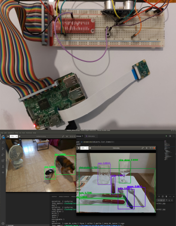

# Object recognizer

[**Cleuton Sampaio**](https://github.com/cleuton)

[**ENGLISH VERSION HERE**](./english.md)

[](https://www.lcm.com.br/site/#livros/busca?term=cleuton)

Clique na imagem para ver uma demonstração em vídeo: 

[](https://youtu.be/_JvOQqQVYdc)

Finalmente terminei a prova de conceito do detector de objetos audível. O objetivo é criar algo que possa ser utilizado por pessoas com necessidades visuais. Esta é uma prova de conceito, ou um MVP. Usei:

- Raspberry Pi 3 com Raspbian;
- Ultrasonic detector HC-SR04;
- Raspberry Pi Câmera;
- Modelo Yolo;
- OpenCV;

Nesta demonstração, estou utilizando o Yolo (You Only Look Once), com python e OpenCV. Me inspirei no artigo de [**Adrian Rosebrock**](https://www.pyimagesearch.com/2018/11/12/yolo-object-detection-with-opencv/) para criar esta PoC. 

Já testei com modelos CNN em Keras, usando bancos como o [**CIFAR**](https://www.cs.toronto.edu/~kriz/cifar.html) e o [**COCODataset**](http://cocodataset.org/#home), mas a performance do Yolo é melhor, embora seja menos preciso. 

Ainda é um projeto inacabado, mas resolvi compartilhar para vocês me ajudarem e desenvolverem suas próprias soluções. 

Estou usando a biblioteca [**gTTS**](https://gtts.readthedocs.io/en/latest/) da Google para transcrever texto em áudio. 

## Montagem do protótipo

Você vai necessitar: 
- Flat cable para conectar Raspberry PI a uma protoboard;
- Raspberry PI 3;
- Raspberry Câmera;
- Sensor ultrassonico HC-SR04;
- Resistor de 330 ohms;
- Resistor de 470 ohms; 
- Switch;
- Jumpers;

Para conectar um sensor HC-SR04 ao Raspberry PI, siga as instruções [**deste artigo**](https://tutorials-raspberrypi.com/raspberry-pi-ultrasonic-sensor-hc-sr04/). A imagem do artigo é essa: 


Eu usei os GPIOs: 17 (TRIGGER) e 24 (ECHO). Na imagem, ele utilizou: 18 (TRIGGER) e 24 (ECHO).

Conecte o switch interligando o terra do circuito (GND) e o GPIO 25. Ao pressionar o Switch, este GPIO mudará o estado e comandará uma foto. 

## Instalação

Você precisará de alguns arquivos do projeto **Darknet**, que é uma implementação do algoritmo **yolo**.

Clone o projeto Darknet (git clone https://github.com/pjreddie/darknet) e copie os arquivos abaixo para a pasta **yolo** deste projeto: 
- darknet/cfg/yolov3.cfg
- darknet/data/coco.names

Clique [**neste link**](https://pjreddie.com/media/files/yolov3.weights) e baixe o arquivo yolov3.weights, colocando na pasta **yolo** do projeto.


Instale o [**VLC**](https://www.videolan.org/vlc/). É melhor se você tiver o [**Anaconda**](https://anaconda.org/) também instalado, bastando criar um ambiente virtual com o comando: 

```
conda env create -f ./env.yml
conda activate object
```

Para executar, basta rodar o script [**simple_detector.py**]: 

```
python simple_detector.py
```

Se quiser, pode passar o caminho de um arquivo de imagem para testar. Eu anexei 2 imagens para você testar.

Ah, e eu criei um Dicionário JSON para traduzir os nomes dos objetos encontrados, incluindo o plural.

## Execução no Raspberry PI

Instale o ambiente [**env-armhf.yml**](./env-armhf.yml). 

O script [**libdetect.py**](./libdetect.py) e o script [**raspdetector.py**](./raspdetector.py) devem ser instalados no Raspberry PI. O script **raspdetector.py** inicia o loop de detecção de objetos.

Ao pressionar o *switch* o dispositivo tirará uma foto e dirá os objetos que estão nela e a distância do objeto mais próximo (veja o vídeo).

Leia o artigo sobre [**instalação da OpenCV**](opencv_armhf.md) para ver como instalar o resto dos componentes em seu Raspberry PI.


