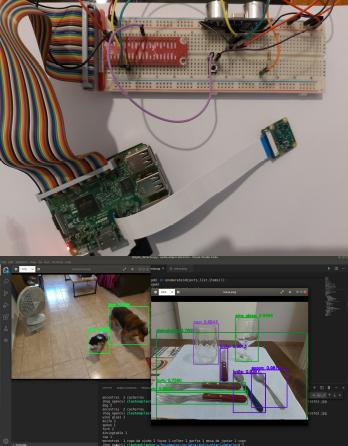
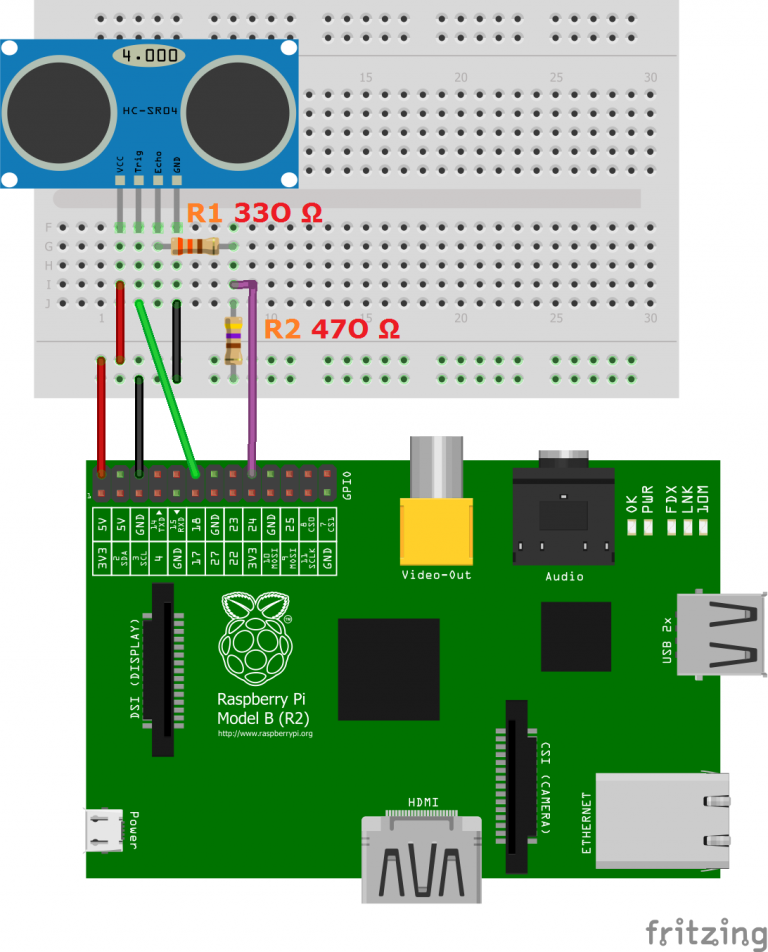

# Object recognizer

[**Cleuton Sampaio**](https://github.com/cleuton)

[](https://www.lcm.com.br/site/#livros/busca?term=cleuton)

Click on the image for a video presentation:

[](https://youtu.be/_JvOQqQVYdc)

Finally I finished the audible object detector proof of concept. The goal is to create something that can be used by people with visual needs. This is a proof of concept, or an MVP. I used:

- Raspberry Pi 3 with Raspbian;
- Ultrasonic detector HC-SR04;
- Raspberry Pi Camera;
- Yolo model;
- OpenCV;

In this demo, I'm using Yolo (You Only Look Once), with python and OpenCV. I was inspired by the [**Adrian Rosebrock**](https://www.pyimagesearch.com/2018/11/12/yolo-object-detection-with-opencv/) article to create this PoC.

I've tested with CNN models in Keras, using banks like [**CIFAR**](https://www.cs.toronto.edu/~kriz/cifar.html) and [**COCODataset**](http://cocodataset.org/#home), but Yolo's performance is better, although less accurate.

It is still an unfinished project, but I decided to share it for you to help me and develop your own solutions.

I'm using Google's [**gTTS**](https://gtts.readthedocs.io/en/latest/) library to transcribe text to audio.

## Prototype assembly

You will need:
- Flat cable to connect Raspberry PI to a protoboard;
- Raspberry PI 3;
- Raspberry Camera;
- Ultrasonic sensor HC-SR04;
- 330 ohm resistor;
- 470 ohm resistor;
- Switch;
- Jumpers;

To connect an HC-SR04 sensor to the Raspberry PI, follow the instructions [**in this article**](https://tutorials-raspberrypi.com/raspberry-pi-ultrasonic-sensor-hc-sr04/). The image of the article is this:



I used the GPIOs: 17 (TRIGGER) and 24 (ECHO). In the image, he used: 18 (TRIGGER) and 24 (ECHO).

Connect the switch by connecting the circuit ground (GND) and the GPIO 25. When you press the Switch, this GPIO will change the state and command a photo.

## Setup

Clone the Darknet project (git clone https://github.com/pjreddie/darknet) and copy following files to  **yolo** folder: 
- darknet/cfg/yolov3.cfg
- darknet/data/coco.names

Click [**on this link**](https://pjreddie.com/media/files/yolov3.weights) and download the yolov3.weights file and save it in the  **yolo** folder.

Install [**VLC**](https://www.videolan.org/vlc/). It is better if you have [**Anaconda**](https://anaconda.org/) also installed, just create a virtual environment with the command:

```
conda env create -f ./env.yml
conda activate object
```

To execute, just run the script [**simple_detector.py**]:

```
python simple_detector.py
```

If you want, you can pass the path of an image file to test. I attached 2 images for you to test.

Oh, and I created a JSON Dictionary to translate the names of the objects found (to Portuguese), but if you are an english speaker, just use the original names.

## Executing on the Raspberry PI

Install the conda environment: [**env-armhf.yml**](./env-armhf.yml). 

The [**libdetect.py**](./libdetect.py) and the [**raspdetector.py**](./raspdetector.py) scripts must be installed on the Raspberry PI. The **raspdetector.py** script starts the object detection loop.

By pressing the *switch* the device will take a photo and tell you the objects that are in it and the distance to the closest object (see the video).

Read the [**OpenCV installation**](https://www.pyimagesearch.com/2018/09/26/install-opencv-4-on-your-raspberry-pi/) to see how to install the rest of the components on your Raspberry PI.


